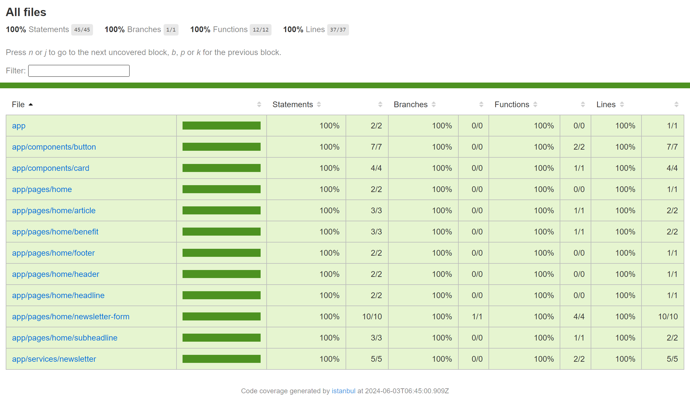

# Angular SSR Landing Page


<div align="center">
  
</div>

## 📌About

The project is a responsive landing page created in Angular 17 that contains the SSR engine. [Demo Here](https://angular-landing-page-ebon.vercel.app/)

## 📈Goals

- Test some new features of [Angular](https://angular.dev) 17
  - New block template syntax (@for, @if, etc...)
  - Image optimization (NgOptimizedImage)
  - Server side rendering (SSR)
  - Standalone components
  - Signals
- Use [TailwindCSS](https://tailwindcss.com) to generate responsive and styled components
- Use [Karma](https://karma-runner.github.io) and [Jasmine](https://jasmine.github.io) to generate automated tests
- Use [Vercel](https://vercel.com/) for project management

## 📁Folder Structure

```bash
src/
 ├── app/                             # Main application folder
      ├── components/                 # Application generic components
          ├── button/                 # Default application button
          └── card/                   # Default application card
      ├── pages/                      # Application pages
          └── home/                   # Home page
              ├── article/            # Home page article section
              ├── benefit/            # Home page benefit section
              ├── footer/             # Home page footer section
              ├── header/             # Home page header section
              ├── headline/           # Home page headline section
              ├── newsletter-form/    # Home page newsletter-form section
              └── subheadline/        # Home page subheadline section
      ├── services/                   # Application services
          └── newsletter/             # Newsletter service
      └── types/                      # Application entity types
          └── newsletter/             # Newsletter types
 └── assets/                          # Static resources (images, fonts, etc.)
```

## 🧪Code Coverage



- To check the code coverage test
  - Run the [test script](#scripts-available)
  - After running the script an `index.html` file will be generated in the `coverage\angular-landing-page` folder, open it in the browser

## ⚙Development Setup

### Prerequisites

- Install [Git](https://www.git-scm.com/downloads)
- Install [Node.js](https://nodejs.org/en) (at least version 18.13)

### Instalation

- Clone this repository:
  ```bash
  git clone https://github.com/GuilhermeFrancisc0/angular-landing-page.git
  ```
- Navigate to the project directory:
  ```bash
  cd angular-landing-page
  ```
- Install dependencies:
  - npm
    ```bash
    npm install
    ```
  - yarn
    ```bash
    yarn install
    ```

#### Optional

- Install angular cli globally on version 17.3.8 (project compatible version) for a more personalized experience
  - npm
    ```bash
    npm i @angular/cli@17.3.8 -g
    ```
  - yarn
    ```bash
    yarn global add @angular/cli@17.3.8
    ```
- Now you can directly use the `ng` command to run the scripts
- Warning: check if you already have @angular/cli installed globally

### Scripts

- You can check the list of scripts in the package.json file under “scripts”
- How to run the scripts:
  - npm
    ```bash
    npm run <script name>
    ```
    - Warning: Some scripts may require adding `ng`
      ```bash
      npm run ng <script name>
      ```
  - yarn
    ```bash
    yarn <script name>
    ```
    - Warning: Some scripts may require adding `ng`
      ```bash
      yarn ng <script name>
      ```
  - ng
    ```bash
    ng <script value>
    ```
    - Warning: If you have installed `ng` globally, execute the key values ​​of the scripts. Example:
      - Script => `"start": "ng serve"`, instead of `yarn start` use `ng serve`

#### Scripts available

- `"ng": "ng"`
  - Basic script to compose the execution of Angular scripts
  - Warning: As exemplified in the warning above, this script aims to help some scripts to be used by those who are using `npm` or `yarn` and have not installed @angular/cli to use global `ng`
- `"start": "ng serve"`
  - Run the project locally. Navigate to `http://localhost:4200/`
- `"build": "ng build"`
  - Compiles an Angular application or library into an output directory named `dist/` at the given output path
- `"watch": "ng build --watch --configuration development"`
  - Looks for the path: `dist` to watch the changes. But as per the new version of the Angular, the default output path will be `dist/<project-name>`
- `"test": "ng test"`
  - Runs unit tests in a project via [Karma](https://karma-runner.github.io)
- `"serve:ssr:angular-landing-page": "node dist/angular-landing-page/server/server.mjs"`
  - Runs Node Express server to listen to server renders

To get more help on the Angular CLI use `ng help` or go check out the [Angular CLI Overview and Command Reference](https://angular.io/cli) page.

## 📝Commit pattern

- Format: `(<type>): <subject>`
- Example:
  ```
  (feature): Add new button
  ^-------^  ^------------^
  |          |
  |          +-> Summary in present tense.
  |
  +------------> Type: chore, docs, feature, fix, refactor, style, or test.
  ```
- Types:
  - `feature`: new feature for the user, not a new feature for build script
  - `fix`: bug fix for the user, not a fix to a build script
  - `docs`: changes to the documentation
  - `style`: formatting, missing semi colons, etc; no production code change
  - `refactor`: refactoring production code, eg. renaming a variable
  - `test`: adding missing tests, refactoring tests; no production code change
  - `chore`: updating grunt tasks etc; no production code change
